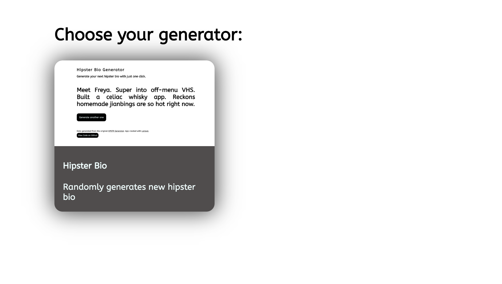
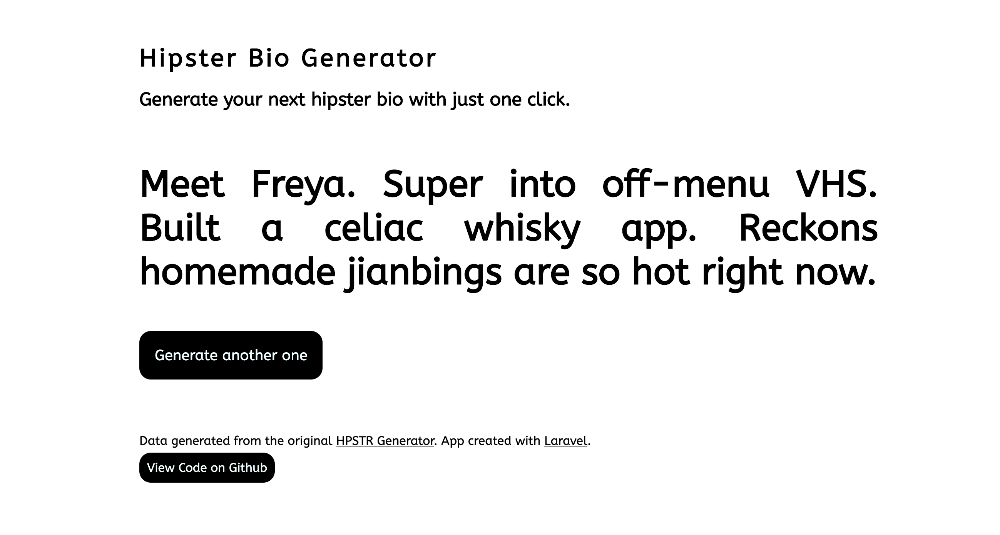

# Hipster Bio Generator

Laravel App for random hipster bios

## Preview

Welcome page / choose your generator


Hipster Bio Generator


## Technologies:
 * Laravel
 * Laravel Blade Templating Engine
 * Guzzle (external HTTP requests)
  
## For local setup follow these instructions:

First you need to clone the repository:

```
git clone git@github.com:oliversiket/hipster-bio.git
```

Change directory to the project folder:

```
cd hipster-bio
```

Install Composer:

```
composer install
```

Create Homestead:

```
vendor/bin/homestead make
```

Rename your env.example file:
```
mv .env.example .env
```
### Make sure you edit your Homestead.yaml file too and change the memory from 2048mb to 512mb

Now you can fire up your virtual machine:

```
vagrant up
```

Visit your app at: http://homestead.test/